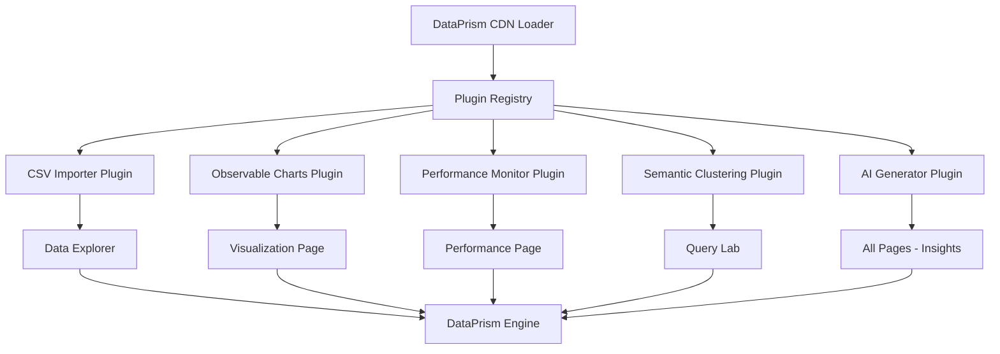

# DataPrism Demo Analytics - Phase 2: Complete Implementation PRP

## Document Information
- **Project**: DataPrism Demo Analytics Application
- **Phase**: 2 - Complete Implementation & Plugin Ecosystem Showcase
- **Version**: 1.0
- **Date**: 2025-07-21
- **Status**: Planning
- **Repository**: `dataprism-apps/apps/demo-analytics/`

## Executive Summary

Phase 2 transforms the DataPrism Demo Analytics from a sophisticated architectural foundation into a fully functional browser-based analytics platform. While the existing infrastructure provides excellent CDN loading, error handling, and UI components, **all core analytics functionality pages are currently placeholders**. This phase implements the complete feature set while showcasing the DataPrism plugin ecosystem to enable developers to build similar applications.

**Current State**: Professional infrastructure with placeholder pages  
**Target State**: Fully functional analytics platform demonstrating DataPrism's capabilities and plugin architecture

## Success Criteria

### Primary Goals
- ✅ Transform all placeholder pages into fully functional analytics interfaces
- ✅ Implement complete data-to-visualization workflow (upload → query → visualize)
- ✅ Showcase DataPrism plugin ecosystem integration
- ✅ Demonstrate browser-native analytics performance capabilities
- ✅ Enable developers to understand and replicate DataPrism implementations

### Key Performance Indicators
- **Data Processing**: Support files up to 50MB, 500K+ rows with <5s load time
- **Query Performance**: Sub-2 second response for complex analytical queries  
- **Plugin Integration**: All available DataPrism plugins functional and demonstrated
- **User Experience**: Complete analytics workflow without technical knowledge
- **Developer Experience**: Clear plugin integration patterns and extensibility
- **Browser Support**: Optimized for Chrome 90+, Firefox 88+, Safari 14+, Edge 90+

## Feature Requirements

### 1. Data Explorer Page Implementation

#### 1.1 Advanced File Upload System
**Priority**: P0 (Critical)  
**Estimated Effort**: 4 days

**Requirements**:
- Multi-format support (CSV, JSON, Parquet, TSV)
- Drag-and-drop interface with preview
- Large file handling with chunked processing
- Schema auto-detection and validation
- Sample data integration for quick demos
- Connection to DataPrism CSV Importer plugin

**Acceptance Criteria**:
- Support files up to 50MB with progress indicators
- Auto-detect file format and encoding
- Preview first 1000 rows before full import
- Integration with DataPrism plugin system for advanced parsing
- Comprehensive error handling with user-friendly messages
- Sample datasets for immediate demo (sales, analytics, financial data)

**Technical Specifications**:
```typescript
interface FileUploadComponent {
  supportedFormats: string[];
  maxFileSize: number;
  chunkSize: number;
  onUpload: (file: File, options: ParseOptions) => Promise<UploadResult>;
  onProgress: (progress: UploadProgress) => void;
  sampleDataSets: SampleDataSet[];
  pluginIntegration: DataPrismPluginManager;
}

interface UploadResult {
  tableName: string;
  schema: TableSchema;
  rowCount: number;
  sampleData: any[];
  importDuration: number;
  warnings?: string[];
}

interface SampleDataSet {
  name: string;
  description: string;
  size: string;
  columns: number;
  rows: number;
  dataGenerator: () => Promise<any[]>;
}
```

#### 1.2 Interactive Data Table Browser
**Priority**: P0 (Critical)  
**Estimated Effort**: 5 days

**Requirements**:
- High-performance virtual scrolling for large datasets
- Advanced filtering and search capabilities
- Column statistics and data profiling
- Export functionality (CSV, JSON, Excel)
- Integration with @tanstack/react-table
- Real-time data quality assessment

**Acceptance Criteria**:
- Smooth scrolling through 500K+ rows
- Global search with column-specific filters
- Click column headers for multi-level sorting
- Inline data type detection and display
- Column statistics panel (min, max, avg, nulls, unique values)
- Export filtered/sorted data subsets
- Cell-level data validation indicators

**Technical Specifications**:
```typescript
interface DataTableComponent {
  data: any[];
  schema: TableSchema;
  virtualizeRows: boolean;
  pageSize: number;
  filters: ColumnFilter[];
  sorting: SortConfig[];
  onCellSelect: (row: number, column: string) => void;
  onExport: (format: ExportFormat, options: ExportOptions) => void;
  statisticsPanel: boolean;
}

interface ColumnFilter {
  column: string;
  type: 'text' | 'number' | 'date' | 'boolean';
  operator: FilterOperator;
  value: any;
}

interface TableSchema {
  columns: ColumnDefinition[];
  primaryKey?: string[];
  foreignKeys?: ForeignKeyDefinition[];
  indexes?: IndexDefinition[];
}
```

#### 1.3 Schema Inspector & Data Profiling
**Priority**: P1 (Important)  
**Estimated Effort**: 3 days

**Requirements**:
- Comprehensive schema visualization
- Advanced data profiling with statistics
- Data quality assessment and recommendations
- Relationship detection between tables
- Integration with DataPrism Performance Monitor plugin

**Acceptance Criteria**:
- Visual schema representation with data types
- Statistical summaries per column (distribution, outliers)
- Data quality scores and improvement suggestions
- Memory usage and performance metrics
- Export schema definitions in multiple formats
- Relationship recommendations for multi-table datasets

### 2. Query Lab Page Implementation

#### 2.1 Professional SQL Editor
**Priority**: P0 (Critical)  
**Estimated Effort**: 5 days

**Requirements**:
- Monaco Editor integration with SQL syntax highlighting
- Auto-completion for tables, columns, and SQL functions
- Query execution with real-time results
- Multi-query support and batch execution
- Integration with DataPrism query engine
- Dark mode support consistent with app theme

**Acceptance Criteria**:
- Full SQL syntax highlighting and error detection
- Intelligent auto-completion based on loaded schemas
- Execute single queries or multiple statement batches
- Real-time syntax validation and error highlighting
- Query execution time tracking and optimization hints
- Integrated help documentation for SQL functions

**Technical Specifications**:
```typescript
interface SQLEditorComponent {
  value: string;
  language: 'sql';
  theme: 'light' | 'vs-dark';
  autoComplete: AutoCompleteProvider;
  onExecute: (query: string) => Promise<QueryResult>;
  onValidate: (query: string) => ValidationResult;
  queryHistory: QueryHistoryManager;
  schemaProvider: SchemaProvider;
}

interface AutoCompleteProvider {
  tables: string[];
  columns: Record<string, ColumnDefinition[]>;
  functions: SQLFunction[];
  keywords: string[];
}

interface QueryResult {
  data: any[];
  metadata: QueryMetadata;
  executionPlan?: QueryPlan;
  performance: PerformanceMetrics;
  warnings?: string[];
}
```

#### 2.2 Advanced Results Display
**Priority**: P0 (Critical)  
**Estimated Effort**: 4 days

**Requirements**:
- High-performance results table with virtual scrolling
- Multiple export formats (CSV, JSON, Excel, PDF)
- Query execution metrics and performance analysis
- Results pagination with lazy loading
- Direct integration to visualization creation

**Acceptance Criteria**:
- Display query results up to 1M+ rows efficiently
- Export results in multiple formats with custom options
- Show detailed execution metrics (time, memory, rows processed)
- Pagination controls with configurable page sizes
- One-click "Visualize Results" integration
- Results comparison between multiple queries

#### 2.3 Query Management & History
**Priority**: P1 (Important)  
**Estimated Effort**: 3 days

**Requirements**:
- Persistent query history with search
- Saved queries with tags and descriptions
- Query templates and snippets library
- Collaborative query sharing (future-ready architecture)
- Performance tracking across query executions

**Acceptance Criteria**:
- Save and organize queries with custom names and tags
- Search query history by content, date, or performance
- Pre-built query templates for common analytics tasks
- Query performance comparison over time
- Export/import query collections

### 3. Visualization Page Implementation

#### 3.1 Comprehensive Chart Type Support
**Priority**: P0 (Critical)  
**Estimated Effort**: 6 days

**Requirements**:
- Multiple visualization libraries (Chart.js, D3.js, Observable Plot)
- Chart types: bar, line, scatter, pie, heatmap, histogram, box plot
- Integration with DataPrism Observable Charts plugin
- Real-time data binding from query results
- Responsive design with mobile support

**Acceptance Criteria**:
- Support 10+ chart types with consistent API
- Seamless integration with query results from Query Lab
- Real-time chart updates when underlying data changes
- Mobile-responsive chart layouts
- Professional chart themes matching app design
- Interactive chart elements (zoom, pan, hover tooltips)

**Technical Specifications**:
```typescript
interface ChartConfiguration {
  type: ChartType;
  data: any[];
  dimensions: {
    x: string;
    y: string | string[];
    group?: string;
    size?: string;
  };
  styling: ChartStyle;
  interactions: InteractionConfig;
  plugins: ChartPlugin[];
}

interface ChartType {
  id: string;
  name: string;
  library: 'chartjs' | 'd3' | 'observable';
  supportedDataTypes: DataType[];
  requiredDimensions: string[];
  optionalDimensions: string[];
}

interface ChartPlugin {
  name: string;
  version: string;
  enhance: (chart: Chart, config: any) => void;
}
```

#### 3.2 Advanced Data Binding Interface
**Priority**: P0 (Critical)  
**Estimated Effort**: 4 days

**Requirements**:
- Drag-and-drop field mapping interface
- Automatic chart type suggestions based on data types
- Real-time preview during configuration
- Advanced aggregation options (GROUP BY, statistical functions)
- Multi-dimensional data support

**Acceptance Criteria**:
- Intuitive drag-and-drop interface for field mapping
- Smart chart type recommendations based on data characteristics
- Live preview updates during configuration changes
- Support for complex aggregations and transformations
- Multi-series chart support for comparative analysis

#### 3.3 Dashboard Creation & Export
**Priority**: P1 (Important)  
**Estimated Effort**: 4 days

**Requirements**:
- Multi-chart dashboard layout system
- Chart export functionality (PNG, SVG, PDF)
- Dashboard templates for common analytics scenarios
- Responsive grid layout for dashboard components
- Integration with Performance Monitor for dashboard optimization

**Acceptance Criteria**:
- Create dashboards with multiple synchronized charts
- Export individual charts or complete dashboards
- Template library for common business analytics scenarios
- Responsive dashboard layouts for different screen sizes
- Performance optimization for dashboard rendering

### 4. Plugins Demo Page Implementation

#### 4.1 Plugin Marketplace Interface
**Priority**: P0 (Critical)  
**Estimated Effort**: 4 days

**Requirements**:
- Visual catalog of available DataPrism plugins
- Live demonstration of each plugin's capabilities
- Plugin installation and configuration interface
- Integration with dataprism-plugins CDN
- Plugin health monitoring and status display

**Acceptance Criteria**:
- Visual cards showing all available plugins from CDN
- Live, interactive demos for each plugin
- One-click plugin activation and configuration
- Real-time plugin health status indicators
- Plugin performance metrics and usage statistics

**Technical Specifications**:
```typescript
interface PluginCatalog {
  availablePlugins: PluginMetadata[];
  installedPlugins: Set<string>;
  onInstall: (pluginId: string) => Promise<void>;
  onConfigure: (pluginId: string, config: any) => void;
  onDemo: (pluginId: string) => void;
  healthStatus: Map<string, PluginHealth>;
}

interface PluginMetadata {
  id: string;
  name: string;
  description: string;
  version: string;
  category: PluginCategory;
  capabilities: string[];
  demoData?: any;
  configSchema?: JSONSchema;
  healthEndpoint?: string;
}

interface PluginDemo {
  pluginId: string;
  demoTitle: string;
  demoDescription: string;
  interactiveComponent: React.ComponentType;
  sampleData: any;
}
```

#### 4.2 Plugin Integration Showcase
**Priority**: P0 (Critical)  
**Estimated Effort**: 5 days

**Requirements**:
- CSV Importer plugin demo with real file processing
- Observable Charts plugin with advanced visualizations
- Performance Monitor plugin with real-time metrics
- Semantic Clustering plugin for data analysis
- AI Generator plugin for automated insights

**Acceptance Criteria**:
- Live demonstrations of each plugin's core functionality
- Integration examples showing plugin API usage
- Performance comparisons between native and plugin implementations
- Code examples for developers to replicate plugin integration
- Plugin customization and configuration examples

#### 4.3 Plugin Development Tools
**Priority**: P2 (Nice to Have)  
**Estimated Effort**: 3 days

**Requirements**:
- Plugin API documentation viewer
- Plugin development template generator
- Plugin testing and validation tools
- Plugin performance profiling interface
- Community plugin submission framework (future-ready)

**Acceptance Criteria**:
- Interactive API documentation for plugin development
- Template generation for custom plugin development
- Built-in plugin testing and validation tools
- Performance profiling tools for plugin optimization

### 5. Performance Page Implementation

#### 5.1 Real-time Performance Dashboard
**Priority**: P0 (Critical)  
**Estimated Effort**: 4 days

**Requirements**:
- Real-time metrics visualization (CPU, memory, query performance)
- Historical performance data tracking
- Performance bottleneck identification
- Integration with DataPrism Performance Monitor plugin
- WebAssembly module performance tracking

**Acceptance Criteria**:
- Live dashboard showing system resource utilization
- Historical charts for performance trend analysis
- Automated performance bottleneck detection and recommendations
- WebAssembly load time and execution performance metrics
- Memory usage tracking with leak detection

**Technical Specifications**:
```typescript
interface PerformanceMetrics {
  cpu: {
    usage: number;
    history: TimeSeries;
  };
  memory: {
    used: number;
    available: number;
    wasmHeap: number;
    jsHeap: number;
    history: TimeSeries;
  };
  queries: {
    executionTimes: number[];
    averageTime: number;
    slowQueries: SlowQuery[];
  };
  plugins: {
    loadTimes: Map<string, number>;
    executionMetrics: Map<string, PluginMetrics>;
  };
}

interface PerformanceRecommendation {
  type: 'memory' | 'cpu' | 'query' | 'plugin';
  severity: 'low' | 'medium' | 'high' | 'critical';
  message: string;
  action: string;
  autofix?: () => Promise<void>;
}
```

#### 5.2 Performance Benchmarking Suite
**Priority**: P1 (Important)  
**Estimated Effort**: 3 days

**Requirements**:
- Automated performance benchmarks for common operations
- Comparison against baseline performance metrics
- Performance regression detection
- Browser-specific performance optimization
- Performance report generation and export

**Acceptance Criteria**:
- Automated benchmark suite for data loading, querying, and visualization
- Performance comparison with configurable baselines
- Browser-specific optimization recommendations
- Detailed performance reports with actionable insights
- Performance trend analysis over time

#### 5.3 Resource Optimization Tools
**Priority**: P2 (Nice to Have)  
**Estimated Effort**: 2 days

**Requirements**:
- Memory optimization recommendations
- Query optimization suggestions
- Plugin performance tuning
- Resource cleanup and garbage collection tools
- Performance best practices documentation

**Acceptance Criteria**:
- Automated memory optimization with user-friendly recommendations
- SQL query optimization suggestions based on execution patterns
- Plugin performance tuning recommendations
- One-click resource cleanup tools

## Technical Architecture

### Plugin Integration Strategy



### Component Architecture

```
src/pages/
├── DataExplorerPage/
│   ├── index.tsx                    # Main page orchestrator
│   ├── components/
│   │   ├── FileUploadZone.tsx      # Multi-format upload with plugins
│   │   ├── DataTableViewer.tsx     # High-performance data table
│   │   ├── SchemaInspector.tsx     # Schema visualization
│   │   ├── SampleDataSelector.tsx  # Pre-built sample datasets
│   │   └── DataQualityPanel.tsx    # Data profiling and quality
│   └── hooks/
│       ├── useFileUpload.ts        # File processing logic
│       ├── useDataProfiling.ts     # Statistical analysis
│       └── useSampleData.ts        # Sample data management

├── QueryLabPage/
│   ├── index.tsx                    # SQL interface orchestrator
│   ├── components/
│   │   ├── MonacoSQLEditor.tsx     # Professional SQL editor
│   │   ├── ResultsViewer.tsx       # Query results display
│   │   ├── QueryHistory.tsx        # History and saved queries
│   │   ├── SchemaExplorer.tsx      # Database schema browser
│   │   └── QueryMetrics.tsx        # Performance analysis
│   └── hooks/
│       ├── useQueryExecution.ts    # Query processing logic
│       ├── useQueryHistory.ts      # History management
│       └── useSchemaCompletion.ts  # Auto-completion provider

├── VisualizationPage/
│   ├── index.tsx                    # Visualization orchestrator
│   ├── components/
│   │   ├── ChartTypeSelector.tsx   # Chart selection interface
│   │   ├── DataBindingPanel.tsx    # Field mapping interface
│   │   ├── ChartRenderer.tsx       # Multi-library chart wrapper
│   │   ├── DashboardBuilder.tsx    # Multi-chart dashboards
│   │   └── ChartExporter.tsx       # Export functionality
│   └── hooks/
│       ├── useChartConfig.ts       # Chart configuration logic
│       ├── useDataBinding.ts       # Data-to-chart mapping
│       └── useChartExport.ts       # Export functionality

├── PluginsDemoPage/
│   ├── index.tsx                    # Plugin showcase orchestrator
│   ├── components/
│   │   ├── PluginCatalog.tsx       # Available plugins grid
│   │   ├── PluginDemo.tsx          # Interactive plugin demos
│   │   ├── PluginInstaller.tsx     # Installation interface
│   │   └── PluginHealthMonitor.tsx # Status monitoring
│   └── demos/
│       ├── CSVImporterDemo.tsx     # File processing demo
│       ├── ObservableChartsDemo.tsx # Advanced visualization demo
│       ├── PerformanceMonitorDemo.tsx # Metrics demo
│       └── SemanticClusteringDemo.tsx # AI analysis demo

└── PerformancePage/
    ├── index.tsx                    # Performance monitoring orchestrator
    ├── components/
    │   ├── MetricsDashboard.tsx    # Real-time performance dashboard
    │   ├── BenchmarkSuite.tsx      # Automated benchmarking
    │   ├── OptimizationPanel.tsx   # Performance recommendations
    │   └── ResourceMonitor.tsx     # System resource tracking
    └── hooks/
        ├── usePerformanceMetrics.ts # Real-time metrics collection
        ├── useBenchmarking.ts      # Benchmark execution
        └── useOptimization.ts      # Performance optimization
```

### Plugin Integration Patterns

```typescript
// Plugin integration example for CSV Importer
const useCSVImporter = () => {
  const { pluginManager } = useDataPrism();
  
  const importCSV = async (file: File): Promise<ImportResult> => {
    const csvImporter = await pluginManager.getPlugin('csv-importer');
    
    if (!csvImporter) {
      // Fallback to native implementation
      return await nativeCSVImport(file);
    }
    
    return await csvImporter.import(file, {
      encoding: 'utf-8',
      delimiter: 'auto',
      headers: true,
      typeInference: true
    });
  };
  
  return { importCSV };
};

// Plugin integration example for Observable Charts
const useObservableCharts = () => {
  const { pluginManager } = useDataPrism();
  
  const createChart = async (config: ChartConfig): Promise<Chart> => {
    const chartsPlugin = await pluginManager.getPlugin('observable-charts');
    
    if (chartsPlugin) {
      return await chartsPlugin.createChart(config);
    }
    
    // Fallback to Chart.js implementation
    return await createChartJSChart(config);
  };
  
  return { createChart };
};
```

## Dependencies and Libraries

### New Dependencies Required
```json
{
  "dependencies": {
    "@monaco-editor/react": "^4.6.0",
    "papaparse": "^5.4.1",
    "chart.js": "^4.4.0",
    "react-chartjs-2": "^5.2.0",
    "react-dropzone": "^14.2.3",
    "@observablehq/plot": "^0.6.11",
    "d3": "^7.8.5",
    "react-virtualized": "^9.22.5",
    "file-saver": "^2.0.5",
    "xlsx": "^0.18.5",
    "react-window": "^1.8.8",
    "react-window-infinite-loader": "^1.0.9",
    "@tanstack/react-virtual": "^3.0.0-beta.60"
  },
  "devDependencies": {
    "@types/papaparse": "^5.3.7",
    "@types/d3": "^7.4.1",
    "@types/file-saver": "^2.0.5",
    "@types/react-virtualized": "^9.21.23",
    "@types/react-window": "^1.8.6"
  }
}
```

### Existing Dependencies (Already Available)
- React Router DOM - Navigation
- Tailwind CSS - Styling
- Lucide React - Icons
- @tanstack/react-table - Table components (upgrade needed)
- @tanstack/react-query - Data fetching
- DataPrism Core - Via CDN
- DataPrism Plugins - Via CDN

## Testing Strategy

### Unit Testing
- File upload and parsing validation
- SQL query execution accuracy
- Chart rendering with various data types
- Plugin integration and fallback mechanisms
- Performance metrics accuracy

### Integration Testing
- End-to-end workflows: upload → query → visualize
- Plugin installation and configuration
- Cross-browser compatibility
- CDN fallback scenarios
- Performance under load

### Performance Testing
- Large file upload processing (50MB+ files)
- Complex query execution with 1M+ rows
- Chart rendering with large datasets
- Memory usage and leak detection
- Plugin performance impact

## Risks and Mitigation

### Technical Risks

| Risk | Impact | Likelihood | Mitigation |
|------|--------|------------|------------|
| Plugin CDN availability | High | Low | Comprehensive fallback implementations |
| Large dataset performance | High | Medium | Chunked processing and virtual scrolling |
| Browser memory limits | High | Medium | Streaming processing and garbage collection |
| Complex query timeouts | Medium | Low | Query optimization and timeout controls |
| Plugin compatibility issues | Medium | Medium | Plugin versioning and compatibility checks |

### User Experience Risks

| Risk | Impact | Likelihood | Mitigation |
|------|--------|------------|------------|
| Complex plugin configuration | Medium | Medium | Smart defaults and guided setup |
| Learning curve for advanced features | Medium | High | Progressive disclosure and tutorials |
| Performance perception with large data | High | Medium | Progress indicators and optimization |

## Success Metrics

### Functional Metrics
- ✅ 100% of placeholder pages replaced with functional implementations
- ✅ All DataPrism plugins integrated and demonstrated
- ✅ Complete data workflow achievable without technical knowledge
- ✅ Performance benchmarks met across all features

### Developer Experience Metrics
- 📊 Plugin integration patterns clearly demonstrated
- 📊 Code examples available for all major features
- 📊 Architecture patterns easily replicable
- 📊 Plugin development path clearly documented

### Performance Metrics
- ⚡ File upload: <5 seconds for 50MB files
- ⚡ Query execution: <2 seconds for complex analytics queries
- ⚡ Visualization rendering: <1 second for 100K+ data points
- 💾 Memory efficiency: <1GB for typical workflows
- 🔌 Plugin load time: <3 seconds for all plugins

### Plugin Ecosystem Showcase
- 🔧 CSV Importer: Advanced file processing capabilities
- 📊 Observable Charts: Professional visualization library
- 📈 Performance Monitor: Real-time system monitoring
- 🧠 Semantic Clustering: AI-powered data analysis
- 🤖 AI Generator: Automated insights and recommendations

## Delivery Timeline

### Phase 2A: Core Functionality (Weeks 1-4)
**Week 1-2: Data Explorer Implementation**
- File upload system with plugin integration
- High-performance data table with virtual scrolling
- Schema inspection and data profiling

**Week 3-4: Query Lab Implementation**
- Monaco SQL editor with auto-completion
- Query execution and results display
- Query history and management

### Phase 2B: Visualization & Plugins (Weeks 5-8)
**Week 5-6: Visualization Engine**
- Multi-library chart integration
- Advanced data binding interface
- Dashboard creation capabilities

**Week 7-8: Plugin Ecosystem Showcase**
- Plugin catalog and demonstration interface
- Live plugin integration examples
- Plugin development tools and documentation

### Phase 2C: Performance & Polish (Weeks 9-10)
**Week 9: Performance Monitoring**
- Real-time performance dashboard
- Benchmarking suite implementation
- Resource optimization tools

**Week 10: Integration & Testing**
- End-to-end testing and optimization
- Cross-browser compatibility validation
- Performance tuning and bug fixes

## Post-Implementation Considerations

### Immediate Enhancements (Phase 3)
- Advanced AI-powered analytics features
- Real-time collaborative analysis capabilities
- Advanced dashboard sharing and embedding
- Custom plugin development framework
- Enterprise security and authentication

### Community & Ecosystem Development
- Plugin marketplace infrastructure
- Developer documentation portal
- Community plugin submission process
- Performance optimization best practices
- Integration guides for common use cases

### Technical Debt & Optimization
- Bundle size optimization with dynamic imports
- Service worker implementation for offline capabilities
- Advanced caching strategies for large datasets
- Accessibility improvements (WCAG compliance)
- Internationalization support

This Phase 2 implementation will transform DataPrism Demo Analytics into a flagship demonstration of browser-based analytics capabilities, showcasing the complete DataPrism ecosystem while providing developers with clear patterns for building similar applications.

## Developer Learning Outcomes

Upon completion, developers will understand:

1. **DataPrism Architecture Patterns**: How to structure applications using DataPrism core and plugins
2. **Plugin Integration**: Best practices for integrating and extending DataPrism functionality
3. **Performance Optimization**: Techniques for handling large datasets in browser environments
4. **CDN-First Development**: Building applications that gracefully handle CDN dependencies
5. **Browser-Native Analytics**: Creating professional analytics applications without server dependencies
6. **Plugin Development**: Foundation for creating custom DataPrism plugins

The completed demo will serve as both a functional analytics platform and a comprehensive reference implementation for the DataPrism ecosystem.