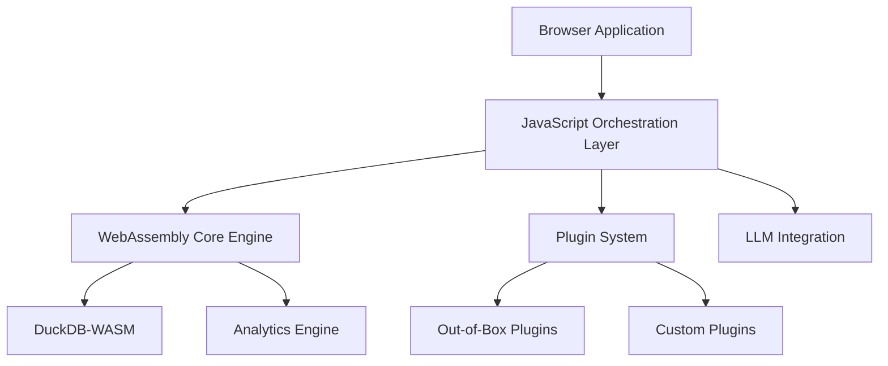

# Architecture

Understanding DataPrism's hybrid architecture design.

## Overview

DataPrism Core uses a hybrid architecture that combines the best of WebAssembly for performance and JavaScript for flexibility.



## Core Components

### 1. WebAssembly Core Engine

The performance-critical components are implemented in Rust and compiled to WebAssembly:

- **Data Processing**: High-performance data transformations
- **Query Engine**: SQL query execution via DuckDB
- **Memory Management**: Efficient memory allocation and cleanup
- **Analytics Functions**: Statistical and mathematical operations

### 2. JavaScript Orchestration Layer

The coordination layer provides:

- **API Management**: Clean JavaScript interfaces
- **Asynchronous Coordination**: Promise-based async operations
- **Error Handling**: Comprehensive error management
- **Browser Integration**: DOM manipulation and event handling

### 3. Plugin System

Extensible architecture for custom functionality:

- **Plugin Framework**: Base classes and interfaces
- **Security Sandbox**: Isolated execution environment
- **Resource Management**: Memory and CPU resource limits
- **Event System**: Plugin communication and lifecycle management

## Performance Characteristics

### Memory Management

- **Shared Memory**: Efficient data sharing between WASM and JS
- **Garbage Collection**: Automatic memory cleanup
- **Memory Limits**: Configurable memory usage constraints
- **Streaming**: Support for processing large datasets

### Query Performance

- **Columnar Storage**: Optimized for analytical queries
- **Vectorized Operations**: SIMD-optimized computations
- **Query Optimization**: Intelligent query planning
- **Caching**: Result and computation caching

## Browser Integration

### WebAssembly Loading

```javascript
// Lazy loading for optimal performance
const engine = new DataPrismEngine({
  wasmPath: '/path/to/dataprism.wasm',
  lazy: true
});
```

### Memory Sharing

```javascript
// Efficient data transfer
const sharedBuffer = new SharedArrayBuffer(1024 * 1024);
const data = new Float64Array(sharedBuffer);
await engine.processData(data);
```

## Security Model

### Sandbox Isolation

- **WASM Sandbox**: WebAssembly provides native sandboxing
- **Plugin Isolation**: Each plugin runs in isolated context
- **Resource Limits**: CPU and memory usage constraints
- **Permission System**: Capability-based security

### Data Protection

- **Local Processing**: Data never leaves the browser
- **Encryption**: Optional data encryption at rest
- **Access Control**: Fine-grained permission system

## Scalability

### Horizontal Scaling

- **Web Workers**: Multi-threaded processing
- **Service Workers**: Background processing
- **SharedArrayBuffer**: Efficient data sharing across threads

### Vertical Scaling

- **Memory Optimization**: Efficient memory usage patterns
- **CPU Optimization**: Vectorized operations and SIMD
- **Storage Optimization**: Compressed data formats

## Development Patterns

### Error Handling

```javascript
try {
  const result = await engine.query('SELECT * FROM data');
} catch (error) {
  if (error.type === 'WASM_ERROR') {
    // Handle WebAssembly errors
  } else if (error.type === 'SQL_ERROR') {
    // Handle SQL query errors
  }
}
```

### Resource Management

```javascript
// Automatic resource cleanup
const engine = new DataPrismEngine();
await engine.initialize();

// ... use engine

// Cleanup is automatic, but can be explicit
await engine.destroy();
```

## Next Steps

- [WebAssembly Engine Details](/guide/wasm-engine)
- [DuckDB Integration](/guide/duckdb)
- [Plugin Development](/plugins/development)
- [Performance Optimization](/guide/performance)