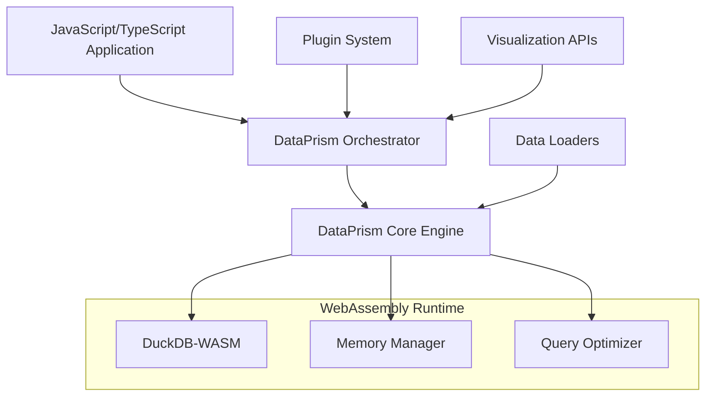

# What is DataPrism Core?

DataPrism Core is a high-performance, browser-based analytics engine that brings the power of traditional data warehouses directly to your web browser. Built on WebAssembly and DuckDB, it enables you to process millions of rows of data without requiring any server infrastructure.

## The Problem

Traditional web-based analytics solutions face several challenges:

- **Server Dependencies**: Most analytics tools require backend infrastructure
- **Data Privacy**: Sensitive data must be sent to external servers
- **Performance Bottlenecks**: Network latency and server resources limit performance
- **Cost & Complexity**: Managing analytics infrastructure is expensive and complex

## The DataPrism Solution

DataPrism Core solves these challenges by bringing analytics directly to the browser:

```typescript
import { DataPrismEngine } from "@dataprism/core";

// Initialize once - no server required
const engine = new DataPrismEngine();
await engine.initialize();

// Process data locally and privately
const results = await engine.query(`
  SELECT region, SUM(revenue) as total_revenue
  FROM sales_data 
  WHERE date >= '2024-01-01'
  GROUP BY region
  ORDER BY total_revenue DESC
`);
```

## Key Benefits

### 🚀 **High Performance**

- **WebAssembly Runtime**: Near-native performance in the browser
- **Columnar Processing**: DuckDB's OLAP-optimized engine
- **Memory Efficiency**: Intelligent memory management and query optimization
- **Parallel Execution**: Multi-threaded processing where supported

### 🔒 **Privacy & Security**

- **Local Processing**: Data never leaves your browser
- **No Network Calls**: Completely offline-capable
- **Client-Side Encryption**: Optional encryption for sensitive data
- **GDPR Compliant**: Built-in privacy protection

### 🛠️ **Developer Experience**

- **TypeScript First**: Full type safety and IntelliSense support
- **Modern APIs**: Promise-based, async/await compatible
- **Comprehensive Docs**: Extensive documentation and examples
- **Plugin Architecture**: Extensible and customizable

### 🌐 **Universal Compatibility**

- **Browser Native**: Works in any modern browser
- **Zero Dependencies**: No server infrastructure required
- **CDN Ready**: Deploy via CDN with integrity validation
- **Framework Agnostic**: Works with React, Vue, Angular, or vanilla JS

## Architecture Overview

DataPrism Core consists of several key components:



### Core Components

1. **DataPrism Engine**: The main interface for data operations
2. **DuckDB-WASM**: WebAssembly-compiled analytical database
3. **Orchestrator**: High-level APIs for common analytics tasks
4. **Plugin Framework**: Extensible architecture for custom functionality
5. **Memory Manager**: Intelligent memory allocation and garbage collection

## Use Cases

DataPrism Core is perfect for:

### 📊 **Interactive Dashboards**

Build real-time dashboards that process data entirely in the browser:

- Financial reporting and analysis
- Sales performance tracking
- Operational metrics monitoring
- Customer analytics and segmentation

### 🔍 **Data Exploration Tools**

Create powerful data exploration interfaces:

- Self-service analytics platforms
- Data science notebooks
- Business intelligence tools
- Ad-hoc query interfaces

### 📈 **Embedded Analytics**

Embed analytics directly in your applications:

- SaaS product analytics
- Customer-facing reporting
- White-label analytics solutions
- IoT data visualization

### 🔬 **Research & Analysis**

Academic and research applications:

- Scientific data analysis
- Survey data processing
- Statistical modeling
- Educational analytics tools

## Performance Characteristics

DataPrism Core is optimized for analytical workloads:

| Operation          | Dataset Size | Performance |
| ------------------ | ------------ | ----------- |
| CSV Loading        | 1M rows      | ~2 seconds  |
| Simple Aggregation | 10M rows     | ~500ms      |
| Complex JOIN       | 1M + 1M rows | ~1 second   |
| GROUP BY + ORDER   | 5M rows      | ~800ms      |
| Window Functions   | 1M rows      | ~600ms      |

_Performance measured on modern desktop browsers (Chrome 120+, 16GB RAM)_

## Browser Support

DataPrism Core requires WebAssembly support:

| Feature           | Chrome 90+ | Firefox 88+ | Safari 14+ | Edge 90+ |
| ----------------- | ---------- | ----------- | ---------- | -------- |
| Basic WebAssembly | ✅         | ✅          | ✅         | ✅       |
| Threading         | ✅         | ✅          | ❌         | ✅       |
| SIMD              | ✅         | ✅          | ✅         | ✅       |
| Bulk Memory       | ✅         | ✅          | ✅         | ✅       |

## Getting Started

Ready to start building with DataPrism Core? Here are your next steps:

1. **[Installation →](/guide/installation)** - Set up DataPrism Core in your project
2. **[Quick Start →](/guide/quick-start)** - Build your first analytics application
3. **[Architecture →](/guide/architecture)** - Deep dive into the technical architecture
4. **[Examples →](/examples/)** - Explore real-world examples and use cases

## Community

Join our growing community of developers building the future of browser-based analytics:

- 💬 [GitHub Discussions](https://github.com/dataprism/core/discussions)
- 🐛 [Report Issues](https://github.com/dataprism/core/issues)
- 📧 [Newsletter](https://dataprism.dev/newsletter)
- 🐦 [Twitter Updates](https://twitter.com/dataprism)
