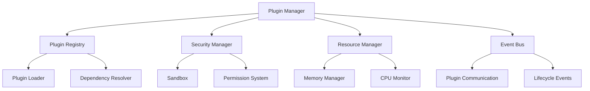

# Plugin Architecture

Understanding the DataPrism plugin system architecture and design patterns.

## Overview

The DataPrism plugin system provides a secure, extensible framework for adding custom functionality to the analytics engine. It's designed with modularity, security, and performance in mind.

## Architecture Components

### Plugin Framework



### Core Components

#### Plugin Manager

```javascript
class DataPrismPluginManager {
    constructor(options = {}) {
        this.registry = new PluginRegistry();
        this.security = new SecurityManager(options.security);
        this.resources = new ResourceManager(options.resources);
        this.eventBus = new EventBus();
        this.loadedPlugins = new Map();
    }
    
    async loadPlugin(pluginId, options = {}) {
        // Plugin loading logic
        const plugin = await this.registry.resolve(pluginId);
        await this.security.validate(plugin);
        const instance = await this.createInstance(plugin, options);
        return instance;
    }
}
```

#### Plugin Registry

```javascript
class PluginRegistry {
    constructor() {
        this.plugins = new Map();
        this.dependencies = new Map();
    }
    
    register(plugin) {
        this.validatePlugin(plugin);
        this.plugins.set(plugin.id, plugin);
        this.dependencies.set(plugin.id, plugin.dependencies || []);
    }
    
    async resolve(pluginId) {
        const plugin = this.plugins.get(pluginId);
        if (!plugin) {
            throw new Error(`Plugin not found: ${pluginId}`);
        }
        
        // Resolve dependencies
        const dependencies = await this.resolveDependencies(pluginId);
        return { plugin, dependencies };
    }
}
```

## Plugin Types

### Visualization Plugins

```javascript
class VisualizationPlugin extends BasePlugin {
    constructor(config) {
        super(config);
        this.category = 'visualization';
        this.capabilities = ['render', 'update', 'export'];
    }
    
    async render(data, config) {
        // Render visualization
        const element = this.createElement(config.container);
        await this.renderChart(element, data, config);
        return element;
    }
    
    async update(element, data, config) {
        // Update existing visualization
        await this.updateChart(element, data, config);
    }
    
    async export(element, format) {
        // Export visualization
        switch (format) {
            case 'png':
                return await this.exportPNG(element);
            case 'svg':
                return await this.exportSVG(element);
            case 'pdf':
                return await this.exportPDF(element);
            default:
                throw new Error(`Unsupported format: ${format}`);
        }
    }
}
```

### Data Processing Plugins

```javascript
class DataProcessingPlugin extends BasePlugin {
    constructor(config) {
        super(config);
        this.category = 'processing';
        this.capabilities = ['transform', 'analyze', 'validate'];
    }
    
    async transform(data, config) {
        // Transform data
        const transformed = await this.applyTransformation(data, config);
        return transformed;
    }
    
    async analyze(data, config) {
        // Analyze data
        const analysis = await this.performAnalysis(data, config);
        return analysis;
    }
    
    async validate(data, schema) {
        // Validate data against schema
        const validation = await this.validateData(data, schema);
        return validation;
    }
}
```

### Integration Plugins

```javascript
class IntegrationPlugin extends BasePlugin {
    constructor(config) {
        super(config);
        this.category = 'integration';
        this.capabilities = ['connect', 'fetch', 'sync'];
    }
    
    async connect(config) {
        // Connect to external service
        this.connection = await this.establishConnection(config);
        return this.connection;
    }
    
    async fetch(query, options) {
        // Fetch data from external source
        const data = await this.connection.query(query, options);
        return data;
    }
    
    async sync(data, config) {
        // Sync data with external service
        const result = await this.connection.sync(data, config);
        return result;
    }
}
```

## Security Architecture

### Sandbox Implementation

```javascript
class PluginSandbox {
    constructor(plugin, permissions) {
        this.plugin = plugin;
        this.permissions = permissions;
        this.context = this.createSecureContext();
    }
    
    createSecureContext() {
        // Create isolated execution context
        const context = {
            // Allowed APIs
            console: this.createSecureConsole(),
            fetch: this.createSecureFetch(),
            localStorage: this.createSecureStorage(),
            
            // Restricted APIs
            eval: undefined,
            Function: undefined,
            window: undefined,
            document: this.createSecureDocument()
        };
        
        return context;
    }
    
    async execute(method, args) {
        // Execute plugin method in sandbox
        return await this.plugin[method].apply(this.context, args);
    }
}
```

### Permission System

```javascript
class PermissionSystem {
    constructor() {
        this.permissions = new Map();
        this.defaults = {
            'network-access': false,
            'dom-access': false,
            'storage-access': false,
            'file-access': false,
            'camera-access': false,
            'microphone-access': false
        };
    }
    
    grant(pluginId, permission) {
        const permissions = this.permissions.get(pluginId) || { ...this.defaults };
        permissions[permission] = true;
        this.permissions.set(pluginId, permissions);
    }
    
    check(pluginId, permission) {
        const permissions = this.permissions.get(pluginId) || this.defaults;
        return permissions[permission] || false;
    }
    
    request(pluginId, permission) {
        // Request permission from user
        return new Promise((resolve) => {
            const modal = this.createPermissionModal(pluginId, permission);
            modal.onConfirm = () => {
                this.grant(pluginId, permission);
                resolve(true);
            };
            modal.onDeny = () => resolve(false);
            modal.show();
        });
    }
}
```

## Resource Management

### Memory Management

```javascript
class PluginMemoryManager {
    constructor(options = {}) {
        this.maxMemoryPerPlugin = options.maxMemoryPerPlugin || 128 * 1024 * 1024; // 128MB
        this.totalMemoryLimit = options.totalMemoryLimit || 1024 * 1024 * 1024; // 1GB
        this.pluginMemory = new Map();
    }
    
    allocate(pluginId, size) {
        const current = this.pluginMemory.get(pluginId) || 0;
        const total = this.getTotalMemoryUsage();
        
        if (current + size > this.maxMemoryPerPlugin) {
            throw new Error(`Plugin ${pluginId} exceeds memory limit`);
        }
        
        if (total + size > this.totalMemoryLimit) {
            throw new Error('Total memory limit exceeded');
        }
        
        this.pluginMemory.set(pluginId, current + size);
        return size;
    }
    
    deallocate(pluginId, size) {
        const current = this.pluginMemory.get(pluginId) || 0;
        const newSize = Math.max(0, current - size);
        this.pluginMemory.set(pluginId, newSize);
    }
    
    getTotalMemoryUsage() {
        return Array.from(this.pluginMemory.values()).reduce((a, b) => a + b, 0);
    }
}
```

### CPU Monitoring

```javascript
class PluginCPUMonitor {
    constructor(options = {}) {
        this.maxCPUPerPlugin = options.maxCPUPerPlugin || 50; // 50% of one core
        this.monitorInterval = options.monitorInterval || 1000; // 1 second
        this.pluginCPU = new Map();
        this.startMonitoring();
    }
    
    startMonitoring() {
        setInterval(() => {
            this.updateCPUUsage();
            this.checkLimits();
        }, this.monitorInterval);
    }
    
    updateCPUUsage() {
        // Monitor CPU usage per plugin
        for (const [pluginId, plugin] of this.loadedPlugins) {
            const usage = this.measureCPUUsage(plugin);
            this.pluginCPU.set(pluginId, usage);
        }
    }
    
    checkLimits() {
        for (const [pluginId, usage] of this.pluginCPU) {
            if (usage > this.maxCPUPerPlugin) {
                this.throttlePlugin(pluginId);
            }
        }
    }
}
```

## Event System

### Event Bus

```javascript
class PluginEventBus {
    constructor() {
        this.events = new Map();
        this.pluginEvents = new Map();
    }
    
    subscribe(event, pluginId, callback) {
        if (!this.events.has(event)) {
            this.events.set(event, new Map());
        }
        
        const listeners = this.events.get(event);
        listeners.set(pluginId, callback);
        
        // Track plugin events
        if (!this.pluginEvents.has(pluginId)) {
            this.pluginEvents.set(pluginId, new Set());
        }
        this.pluginEvents.get(pluginId).add(event);
    }
    
    publish(event, data) {
        const listeners = this.events.get(event);
        if (listeners) {
            for (const [pluginId, callback] of listeners) {
                try {
                    callback(data);
                } catch (error) {
                    console.error(`Error in plugin ${pluginId} event handler:`, error);
                }
            }
        }
    }
    
    unsubscribe(pluginId) {
        // Remove all subscriptions for plugin
        const events = this.pluginEvents.get(pluginId) || new Set();
        for (const event of events) {
            const listeners = this.events.get(event);
            if (listeners) {
                listeners.delete(pluginId);
            }
        }
        this.pluginEvents.delete(pluginId);
    }
}
```

## Plugin Lifecycle

### Lifecycle Management

```javascript
class PluginLifecycleManager {
    constructor() {
        this.plugins = new Map();
        this.states = new Map();
    }
    
    async loadPlugin(pluginId, config) {
        this.setState(pluginId, 'loading');
        
        try {
            const plugin = await this.createPlugin(pluginId, config);
            this.plugins.set(pluginId, plugin);
            
            await this.initializePlugin(plugin);
            this.setState(pluginId, 'initialized');
            
            await this.startPlugin(plugin);
            this.setState(pluginId, 'running');
            
            return plugin;
        } catch (error) {
            this.setState(pluginId, 'error');
            throw error;
        }
    }
    
    async unloadPlugin(pluginId) {
        const plugin = this.plugins.get(pluginId);
        if (!plugin) return;
        
        this.setState(pluginId, 'stopping');
        
        try {
            await this.stopPlugin(plugin);
            await this.destroyPlugin(plugin);
            
            this.plugins.delete(pluginId);
            this.states.delete(pluginId);
        } catch (error) {
            this.setState(pluginId, 'error');
            throw error;
        }
    }
    
    async initializePlugin(plugin) {
        if (plugin.initialize) {
            await plugin.initialize();
        }
    }
    
    async startPlugin(plugin) {
        if (plugin.start) {
            await plugin.start();
        }
    }
    
    async stopPlugin(plugin) {
        if (plugin.stop) {
            await plugin.stop();
        }
    }
    
    async destroyPlugin(plugin) {
        if (plugin.destroy) {
            await plugin.destroy();
        }
    }
}
```

## Communication Patterns

### Plugin-to-Plugin Communication

```javascript
class PluginCommunicationManager {
    constructor(eventBus) {
        this.eventBus = eventBus;
        this.channels = new Map();
    }
    
    createChannel(name, participants) {
        const channel = new PluginChannel(name, participants, this.eventBus);
        this.channels.set(name, channel);
        return channel;
    }
    
    getChannel(name) {
        return this.channels.get(name);
    }
}

class PluginChannel {
    constructor(name, participants, eventBus) {
        this.name = name;
        this.participants = new Set(participants);
        this.eventBus = eventBus;
    }
    
    send(from, to, message) {
        if (!this.participants.has(from) || !this.participants.has(to)) {
            throw new Error('Plugin not authorized for this channel');
        }
        
        this.eventBus.publish(`channel:${this.name}:${to}`, {
            from,
            to,
            message,
            timestamp: Date.now()
        });
    }
    
    broadcast(from, message) {
        if (!this.participants.has(from)) {
            throw new Error('Plugin not authorized for this channel');
        }
        
        for (const participant of this.participants) {
            if (participant !== from) {
                this.send(from, participant, message);
            }
        }
    }
}
```

## Best Practices

### Plugin Development

1. **Single Responsibility**: Each plugin should have a single, well-defined purpose
2. **Loose Coupling**: Minimize dependencies between plugins
3. **Error Handling**: Implement comprehensive error handling
4. **Resource Cleanup**: Always clean up resources in the destroy method
5. **Security**: Follow security best practices and request minimal permissions

### Performance

1. **Lazy Loading**: Load plugins only when needed
2. **Memory Management**: Monitor and limit memory usage
3. **Async Operations**: Use async/await for non-blocking operations
4. **Caching**: Cache expensive operations when appropriate
5. **Optimization**: Profile and optimize critical paths

### Security

1. **Principle of Least Privilege**: Request only necessary permissions
2. **Input Validation**: Validate all inputs and outputs
3. **Secure Communication**: Use secure channels for sensitive data
4. **Sandbox Compliance**: Work within sandbox limitations
5. **Regular Updates**: Keep plugins updated with security patches

## Next Steps

- [Plugin Development Guide](/plugins/development)
- [Security Best Practices](/plugins/security)
- [Plugin API Reference](/plugins/api)
- [Testing Plugins](/plugins/testing)